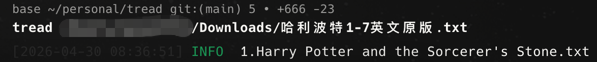
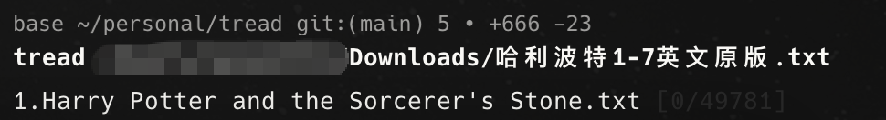

# tread — 终端伪装小说阅读器

[](https://opensource.org/licenses/MIT)
[](https://www.rust-lang.org)

在终端里看小说，屏幕看起来却像服务器日志。`tread` 使用 ratatui 的 `Inline` 视口直接在当前终端底部渲染 1-3 行文字，不进入全屏 alternate screen，也不会清屏——同事路过只会看到平平无奇的命令行输出。

```bash
# 以日志伪装模式打开小说，每次只显示 1 行
tread novel.txt --mode log --lines 1
```

**核心特性**

- **三种伪装模式** — 按 `t` 一键切换日志时间戳、极简输出或代码注释形态
- **1-3 行占位** — 紧贴终端底部，不占用全屏，不影响历史输出
- **自动续读** — 退出时保存行号和显示模式到书签文件，下次打开自动恢复
- **章节列表** — 按 `g` 呼出目录，支持超长列表滚动
- **全文搜索** — 按 `/` 输入关键词，`n` 跳转下一个匹配
- **多格式直读** — 原生支持 `.txt`、`.epub`、`.mobi`、`.azw`、`.azw3`、`.pdf`
- **编码自动识别** — UTF-8、GBK、GB18030、BIG5 无需手动转码

## 安装

```bash
git clone https://github.com/dkcn2006/tread.git
cd tread
./install.sh
```

脚本会自动完成全部环境配置：
1. **安装 Rust** — 检测到未安装时自动下载 rustup 并安装
2. **配置 Cargo 镜像** — 交互式询问 / 非交互环境自动配置 USTC 加速镜像
3. **持久化 PATH** — 将 cargo 环境写入 `~/.bashrc` / `~/.zshrc`
4. **编译安装** — `cargo install --path .` 编译 release 版本
5. **全局可用** — 确保 `~/.cargo/bin` 在 PATH 中
6. **验证** — 安装后执行 `tread --help` 确认可用

> 首次编译需几分钟，取决于网络和设备性能。国内用户建议使用镜像加速。

**非交互模式（CI / 自动化脚本）：**
```bash
TREAD_MIRROR=yes ./install.sh   # 自动配置镜像
TREAD_MIRROR=no  ./install.sh   # 跳过镜像，使用官方源
```

**安装完成后，在任意目录都能直接用：**
```bash
tread your-novel.txt
tread your-novel.epub
tread your-novel.mobi --mode comment --lines 2
```

---

### 手动安装

如果你更习惯自己控制每一步：

```bash
TREAD_MIRROR=yes ./install.sh   # 自动配置 USTC 镜像
TREAD_MIRROR=no  ./install.sh   # 使用官方 crates.io
```

## 伪装模式

`tread` 提供三种伪装形态，按 `t` 键循环切换：

### Log 模式

最常用，看起来像后端日志输出：



### Minimal 模式

极简，像一条普通的命令输出：



### Comment 模式

像代码注释，适合前端项目：


| 模式 | 效果 | 适用场景 |
|------|------|---------|
| **Log** | `[时间戳] INFO  小说内容...` | 最常用，看起来像后端日志 |
| **Minimal** | `小说内容... [42/1205]` | 极简，像一条普通的命令输出 |
| **Comment** | `// 小说内容... [Ch.3 \| 2.1%]` | 像代码注释，适合前端项目 |

所有模式都只占终端 **1-3 行**，不进入 alternate screen，不刷屏，**隐蔽性拉满**。

## 快速开始

```bash
# 基本用法，默认以 log 模式打开
tread "txt/冰与火之歌一：权利的游戏.txt"

# 指定 comment 模式，显示 2 行
tread novel.epub --mode comment --lines 2
```

| 按键 | 功能 |
|------|------|
| `j` / `↓` / `Enter` | 向下滚动一行 |
| `k` / `↑` | 向上滚动一行 |
| `Space` / `PageDown` | 向下翻一屏 |
| `b` / `PageUp` | 向上翻一屏 |
| `Home` | 跳到开头 |
| `End` | 跳到末尾 |
| `t` | 切换伪装模式 |
| `/` | 搜索 |
| `n` | 重复上次搜索，跳到下一个匹配 |
| `g` | 打开章节目录 |
| `q` | 正常退出并保存进度 |
| `Esc` | **老板键** — 清屏并立即退出 |

### 搜索

1. 按 `/` 呼出搜索框，底部出现 `/` 光标提示
2. 输入关键词，支持任意文本（自动忽略大小写）
3. 按 `Enter` 确认，跳转到第一个匹配行
4. 按 `n` 继续搜索下一个匹配处
5. 搜索框输入中按 `Esc` 可取消搜索

### 章节目录

1. 按 `g` 呼出章节列表，显示当前章节附近的所有章节
2. 用 `j` / `↓` 或 `k` / `↑` 上下导航
3. 按 `Enter` 跳转到选中章节
4. 按 `Esc` / `q` / `g` 关闭章节列表

> 章节列表支持滚动，即使小说有几十个章节也不会溢出显示区域。

### 书签

退出时自动保存阅读进度（行号、显示模式）到 `~/.config/terminal-read/bookmarks.json`。下次打开同一本书时自动续读。

### 编码

自动检测 UTF-8 / GBK / GB18030 / BIG5 等中文编码，无需手动转码。空文件或仅含空白行的文件会给出友好错误提示。

### 电子书支持

支持直接读取 **.epub** / **.mobi** / **.azw** / **.azw3**（Kindle 格式）和 **.pdf** 电子书，自动提取正文并清理格式，章节识别、书签、搜索等功能与 txt 文件完全一致。

```bash
# epub 格式
tread "novel.epub"

# mobi 格式
tread "novel.mobi"
tread "novel.azw3" --mode comment --lines 2

# pdf 格式
tread "novel.pdf"
```

### 终端适配

支持终端窗口实时调整大小，内容自动重新换行，无需重启程序。

## 特性亮点

- **终端自适应** — 窗口大小改变时内容自动重新换行
- **搜索缓存优化** — 大文件搜索不卡顿，自动忽略大小写
- **章节列表滚动** — 支持超长章节列表，以当前章节为中心显示
- **Log 模式着色** — INFO/DEBUG/TRACE/WARN 分别用绿/青/灰/黄着色，更像真日志
- **崩溃保护** — 即使程序异常退出，终端也会自动恢复原始状态
- **类型安全书签** — 显示模式直接序列化枚举值，不再依赖数字索引

## 技术栈

- [ratatui](https://github.com/ratatui/ratatui) — TUI 渲染（Inline viewport，不进入 alternate screen）
- [crossterm](https://github.com/crossterm-rs/crossterm) — 跨平台终端控制
- [clap](https://github.com/clap-rs/clap) — CLI 参数解析
- [encoding_rs](https://github.com/hsivonen/encoding_rs) — 中文编码检测

## License

MIT
